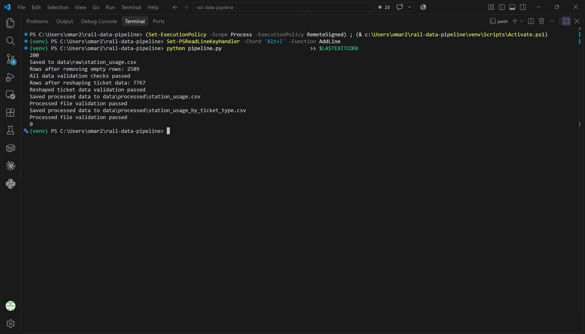
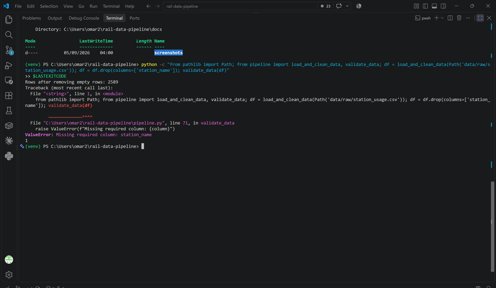

# Rail station usage data pipeline

A Python portfolio project using the Office of Rail and Road (ORR)
Table 1410 station-usage CSV.

This project downloads rail station usage data and cleans it with Python.
It checks for problems such as missing columns and negative counts,
then saves two CSV files, one containing the cleaned station data,
and another showing usage by ticket type.

## What the pipeline does

1. Downloads the CSV and saves the response bytes unchanged in `data/raw/`.
2. Cleans column names, removes fully empty rows and handles missing values.
3. Validates the cleaned station data.
4. Reshapes three ticket-type columns into rows using pandas `melt`.
5. Validates the reshaped data.
6. Saves both processed CSVs and checks that each file exists and is nonempty.

## Outputs

Files are saved in `data/processed/`.

| File | Contents | Current rows | Columns |
| --- | --- | --- | --- |
| `station_usage.csv` | Complete cleaned station table | 2,589 | 18 |
| `station_usage_by_ticket_type.csv` | One row per station and ticket type | 7,767 | 5 |

The ticket types are full-price, reduced-price and season tickets.
Each station produces three ticket rows. Missing measurements remain
missing rather than being replaced with zero.

## Development

The project began with downloading and cleaning the source data.
It was then organised into functions and extended with validation.
Ticket-type reshaping and the second CSV output were added afterwards to make comparisons by ticket type easier.

## Setup and running

You need Python, Git and an internet connection.
This project was developed using Python 3.14.3 on Windows.

### First-time setup

Open PowerShell and download the project:

```powershell
git clone https://github.com/OmarM-Devv/rail-data-pipeline.git
cd rail-data-pipeline
```

Create and activate a virtual environment:

```powershell
python -m venv venv
.\venv\Scripts\Activate.ps1
```

Install the required packages:

```powershell
python -m pip install -r requirements.txt
```

### Run the pipeline

Run these commands from the project folder containing `pipeline.py`:

```powershell
python pipeline.py
$LASTEXITCODE
```

A successful run saves both processed CSVs and exits with code `0`.
A failed validation raises an error and exits with a non-zero code.

When opening a new PowerShell terminal, activate the virtual environment
again before running the pipeline.


## Cleaning decisions

- Skip the three introductory rows before the source table.
- Remove rows only when every field is empty.
- Standardise column names using lowercase letters and underscores.
- Read numbers containing thousands separators using `read_csv(thousands=",")`.
- Treat `[z]` (not applicable) as missing, never as zero.
- Keep National Location Codes as text because they identify stations.
- Convert seven measurement columns to pandas nullable `Int64`,
  which stores whole numbers while allowing missing values.

## Validation

Before saving either output, the pipeline checks:

- The station table contains all 18 required columns.
- The station table contains between 2,000 and 3,500 rows.
- Station names and National Location Codes are present and not blank.
- The checked measurement columns are numeric and contain no negative values.
- The ticket table has the five expected columns and three rows per station.
- Ticket types are present and match the three expected categories.
- No station code and ticket-type combination appears more than once.

After saving, it checks that each output file exists and contains bytes.
Failed checks raise an error and stop the program.

## Limitations

- Validation catches specific problems; it does not prove every value is correct.
- The station row-count range is a project sanity check, not an ORR rule.
- Missing measurements are allowed.
- The post-save file check does not read back or compare CSV contents.
- Each successful download replaces the previous raw file. The downloaded
  bytes are kept unchanged, but historical versions are not retained.
- If data validation fails, processed files from a previous run remain.
- Checks were tested manually; there is no automated test suite.

## Data source

Source: Office of Rail and Road,
[Table 1410 station-usage CSV](https://dataportal.orr.gov.uk/media/1909/table-1410-passenger-entries-and-exits-and-interchanges-by-station.csv).

The current downloaded file covers April 2024 to March 2025.
The raw CSV is downloaded when the pipeline runs and is excluded from Git.

## Example output

These three rows from `station_usage_by_ticket_type.csv` show the
ticket-type measurements for one station:

```csv
station_name,national_location_code_nlc,region,ticket_type,entries_and_exits
Abbey Wood,5131,London,full_price,3782112
Abbey Wood,5131,London,reduced_price,6137708
Abbey Wood,5131,London,season,1953866
```

In the cleaned station table, these measurements occupy three columns
in one station row. After reshaping, they occupy one measurement column
across three rows. The station details repeat to identify each row.

The all-ticket total is excluded from this output because it combines
the three ticket categories.

## Evidence

### Successful run

The pipeline produces both CSV outputs, passes validation and exits
with code `0`.



### Deliberate validation failure

This manual test removes `station_name` from the table in memory.
Validation raises a missing-column error and the process exits with
code `1`. The saved CSV files are unchanged.

